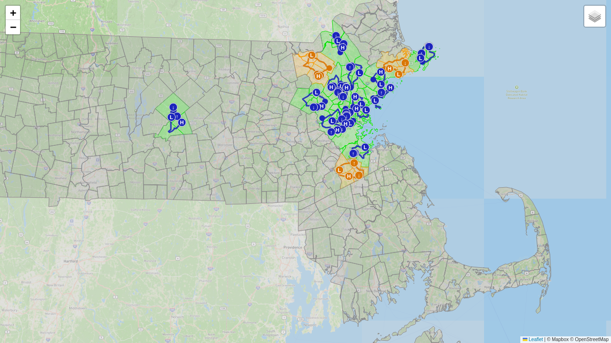

# mass-bike-routes

A small Python project for tracking Massachusetts bike-route progress and rendering it on an interactive map.



## What it does

- colors completed towns on a statewide map
- overlays GPX ride tracks
- optionally computes distance-to-Woburn data for each municipality

## Quick start

Assuming you have the `uv` package manager installed,

```bash
uv sync
export MAPBOX_ACCESS_TOKEN=...
export GMAPS_API_KEY=...
uv run python main.py          # refreshes cities.csv (generally not needed)
uv run python completions.py   # builds completions.html (when adding new rides)
```

## Project data

- `completions.csv` — completed towns and linked GPX files. Manually updated by us.
- `gpx/` — ride tracks. Manually contributed by us.
- `TOWNSSURVEY_POLY.*` — Massachusetts town boundary shapefiles, downloaded from the [MassGIS Data Portal](https://www.mass.gov/info-details/massgis-data-municipalities).

Output: `completions.html` (plus a gzipped copy). Interactive Mapbox map which shows completed townships and GPX tracks. Not hosted yet.
